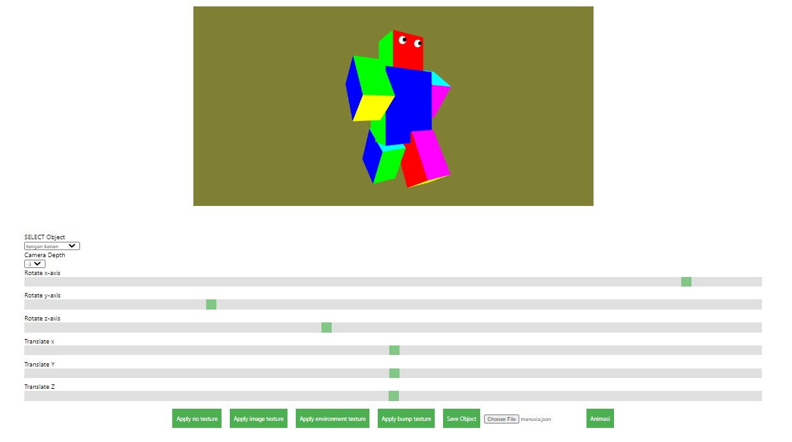
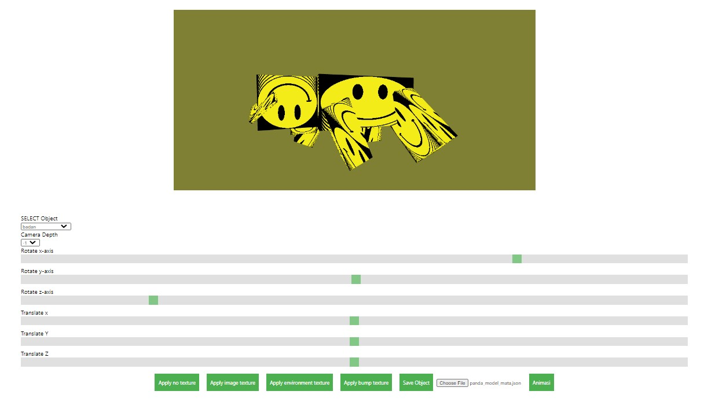
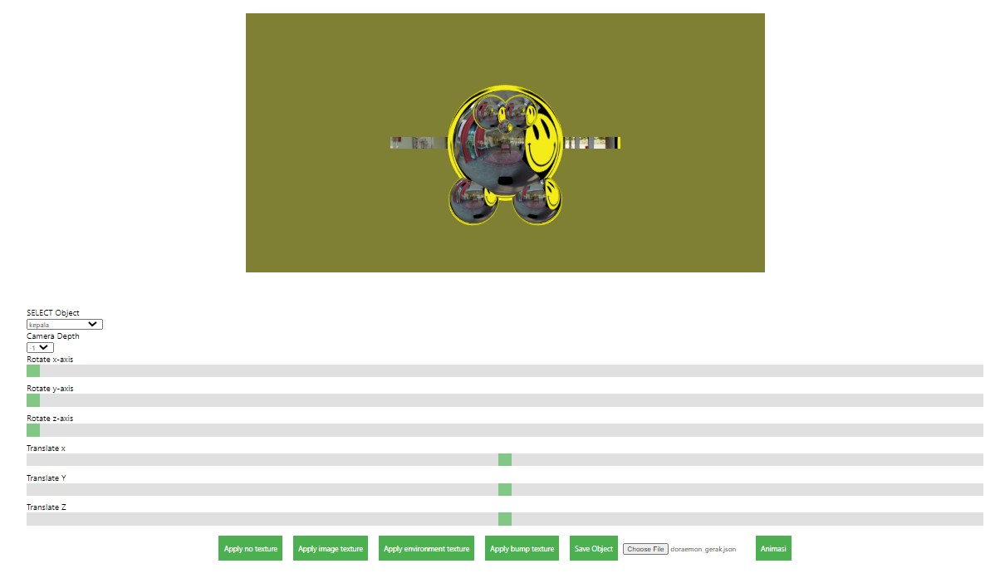

# ARTICULATED MODEL
## Deskripsion
Program yang dibuat adalah pembuatan articulated model 3D yang dapat di manipulasi antara objeknya ataupun posisi kamera. Penampilan articulated model ini memanfaatkan WebGL sebagai tools untuk melakukan rendering terhadap titik-titik dan gambar yang ingin di render. Fitur-fitur yang difasilitasi dalam program ini dimulai dari mengatur view model kamera (menjauh atau mendekat), melakukan rotasi dan translasi pada object, menghidupkan atau mematikan shading pada object, dan menghidupkan atau mematikan animasi pada object.

## Tampilan Program

### No mapping, with color buffer + Model 1


### Image / Texture mapping + Model 2


### Environment mapping + Model 3


## Requirement
* Browser support WebGL
* React to run the server

## How to Run Program
1. Masuklah ke directory project ini.
2. Jalankan command berupa ```npm install``` pada command prompt (jika pertama kali).
3. Jalankan command berupa ```npm start``` pada command prompt.
4. Program akan secara otomatis terbuka di browser.
5. Selamat menjalankan aplikasi Articulated Model Viewing.

## Functionality Help
1. Rotasi Object
Rotasi Object adalah fungsi untuk merotasi object. Terdapat 3 slider, yaitu:
- Rotate x-axis : merotasi object terhadap sumbu x
- Rotate y-axis : merotasi object terhadap sumbu y
- Rotate z-axis : merotasi object terhadap sumbu z
2. Translate Object
Translate Object adalah fungsi untuk mentranslasi object. Terdapat 3 slider, yaitu:
- Translate x : mentranslate object terhadap pada x
- Translate y : mentranslate object terhadap pada y
- Translate z : mentranslate object terhadap pada z
3. Save
Save digunakan untuk menyimpan model object. Hal yang disimpan yaitu definisi object, hubungan parent-child, dan animasi dari setiap komponen model.
4. Load
Load digunakan untuk memuat model object.
5. Select Object
Select Object digunakan untuk memilih object yang ingin dimanipulasi.
6. Camera Depth
Camera Depth digunakan untuk memilih kedalam dari camera.
7. Animasi
Animasi adalah button yang digunakan untuk menjalankan skenario gerakan animasi dari model yang dipilih.
8. Shader
Shader adalah fungsi untuk menghidup-matikan shader dari object.
## Author
IF3260 Grafika Komputer Kelompok **10**
* 13518017 - Farras Mohammad Hibban Faddila
* 13518062 - Ricky Fernando
* 13518074 - Iqbal Naufal

Link laporan:
[Laporan Tugas Besar 3 Grafkom](https://docs.google.com/document/d/1bplUU3LiU1ltcuK-K4iIGlEvZ4jDUDj3ODBh5GBAhVI)